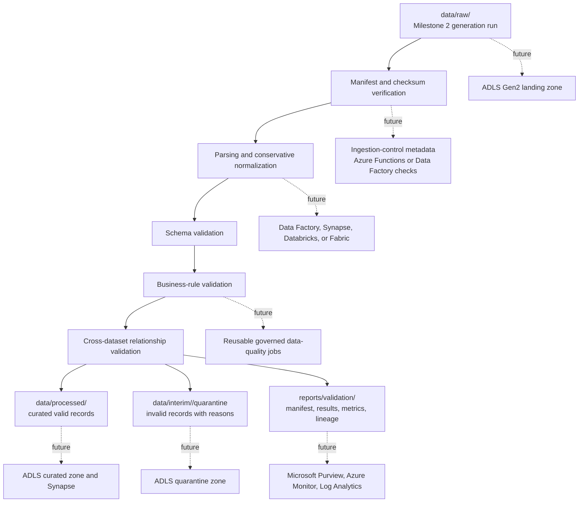

# Ingestion And Validation Architecture

Milestone 3 adds a governed local ingestion and validation workflow for completed Milestone 2
generation runs. It does not regenerate source data and does not deploy Azure resources.

## Flow

## Components

- Source discovery requires an explicit source run directory and verifies required artefacts.
- Manifest integrity checks validate source filenames, schema version, row counts, checksums, keys,
  formats, field lists, and safe paths.
- Readers parse CSV and JSON Lines with explicit UTF-8 handling.
- Normalization trims strings, parses timestamps to UTC, and parses numeric and boolean values
  without inventing defaults.
- Validation rules emit structured findings with stable rule identifiers, severities, categories,
  record identifiers, source rows, and quarantine eligibility.
- Outputs are written through temporary directories and promoted only after a complete run.

## Output Zones

- `data/interim/<validation_run_id>/normalized`: normalized valid records for audit.
- `data/interim/<validation_run_id>/quarantine`: invalid records with all failure reasons.
- `data/processed/<validation_run_id>`: curated valid records preserving the seven source names.
- `reports/validation/<validation_run_id>`: validation manifest, results, metrics, lineage, and
  summary.

Milestone 3 validation remains local-first and deterministic. Azure service mappings are
documented for later milestones only.
