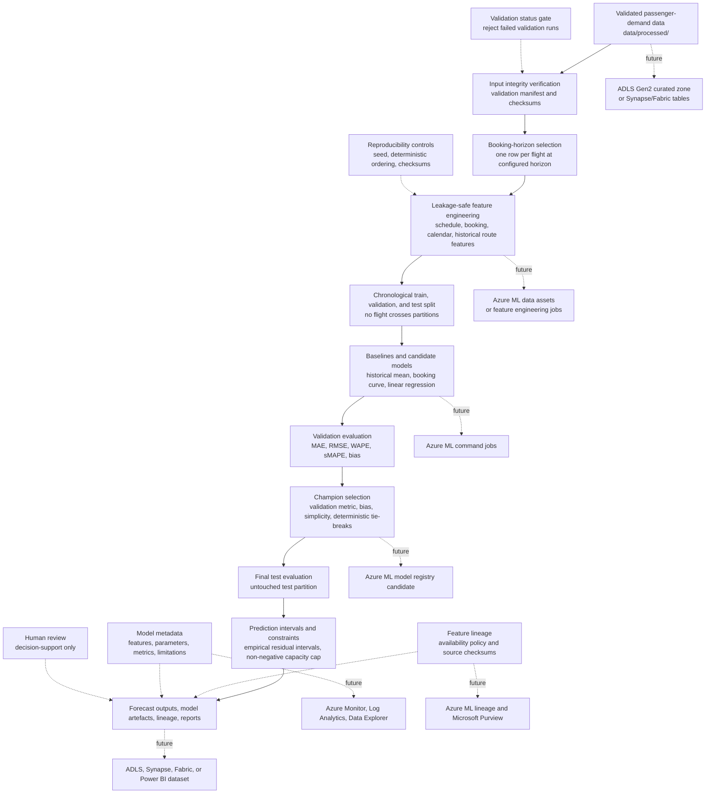

# Passenger Forecasting Architecture

Milestone 4 adds deterministic local passenger-demand forecasting from Milestone 3 validated
outputs. It does not implement delay prediction, maintenance analytics, disruption scoring,
optimisation, GenAI, dashboards, monitoring, or Azure deployment.

## Flow

## Prediction Design

The principal grain is one forecast per scheduled flight at the configured booking horizon. The
primary target is `expected_final_passengers`, using the booking observation at exactly the
configured horizon when available. If an exact observation is unavailable, the nearest earlier
observation is used; observations closer to departure than the configured horizon are not used.

## Leakage Controls

The feature set excludes actual departure outcomes, delay history outcomes, cancellations,
diversions, target-derived load factor, and future booking observations. Historical route features
are calculated only from earlier flights in deterministic operating-date order.

Preprocessing and model fitting use training rows only. Champion selection uses validation metrics
only, and final test metrics are calculated once for the selected champion.
