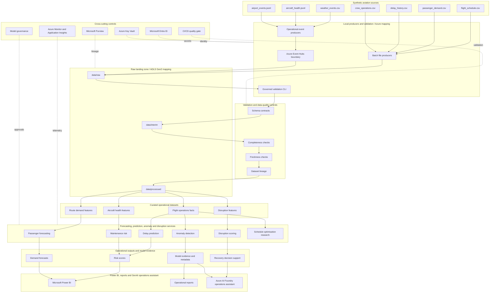

# Target Architecture

The target state is a local-first implementation with clean deployment boundaries for Azure.
Local folders, producers, configuration, ingestion, and validation interfaces represent Azure
services until later milestones introduce cloud deployments.

## Cross-Cutting Concerns

- Microsoft Entra ID will provide identity and access control in the Azure target state.
- Azure Key Vault will manage secrets; no credentials belong in repository configuration.
- Microsoft Purview will support data cataloguing, lineage, classification, and retention.
- Azure Monitor and Application Insights will capture telemetry and operational health.
- CI/CD will enforce linting, formatting, type checks, tests, documentation checks, YAML checks,
  and repository validation.
- Data-quality controls will guard schema, completeness, timeliness, referential integrity, and
  sensitivity expectations.
- Model governance will track features, training windows, evaluation results, metadata, approval
  status, and operational limitations.
